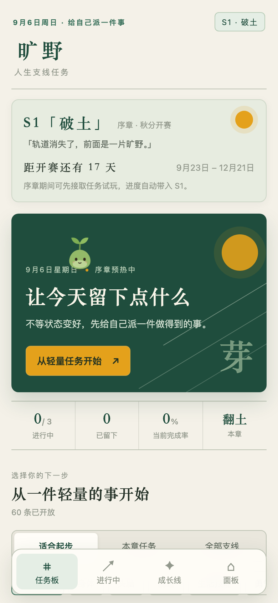
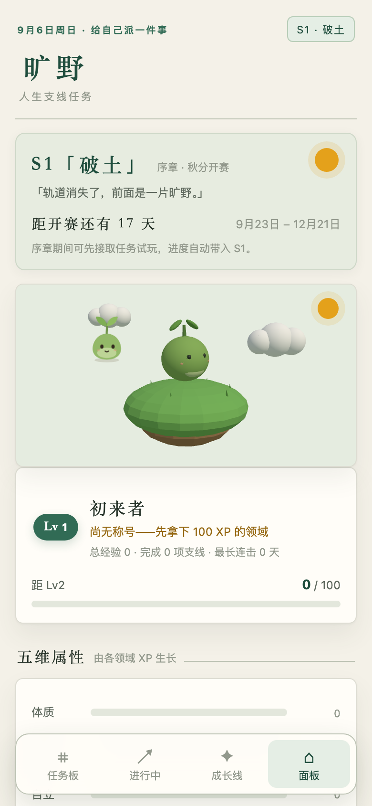

# 旷野 · 人生支线任务

> 轨道消失了，前面是一片旷野。

把"自己给自己派活"做成一款游戏：**每个赛季发布一批有难度的跨领域支线任务，接取、打卡、完成、结算，所有成就永久累积进你的人生角色面板。**

**[在线体验](https://thysummer14.github.io/kuangye/)** —— 无需注册，数据只存你的浏览器。当前版本已更新为“今日入口”体验：打开就能挑一件今天做得到的事。

| 任务板 | 角色面板（小芽的 3D 漂浮草岛） |
| --- | --- |
|  |  |

## 为什么做这个

上大学/毕业后轨道消失，外部意义消失、内部意义未建立，人容易掉进"存在主义真空"，用廉价娱乐填洞。游戏的任务系统是被验证过的"意义脚手架"：明确目标 + 可见进度 + 完成结算 + 长期档案。旷野把它套在真实生活上——**空虚的反面不是快乐，是能看见自己在变强。**

完整产品设计（心理学依据、赛季制、社会化路线）见 [DESIGN.md](DESIGN.md)。

## 特性

- **季 + 月双层赛制**：3 个月大赛季（主题词如 S1「破土」）+ 月度章节副本（翻土/播种/发芽），全局同步同一块赛季时钟
- **任务库**：五领域（身体 / 头脑 / 创造 / 生活技能 / 勇气与连接）× E–S 六档难度 × 三类型（一次性 / 连击 / 累积），首批 69 条中国语境任务
- **今日入口**：首屏直接回答"今天做什么"——适合起步（每领域精选低门槛任务）/ 本章任务 / 全部支线三档浏览，进行中的支线一卡直达
- **一件事启动**：没有进行中任务时，首页会给出一条“今日只选这一件”的建议，并用三步仪式引导第一次进入的用户开始行动
- **反贪多设计**：同时进行 ≤3（赛季级 ≤2 + 本章 ≤2），放弃要写理由、归入"墓志铭"；连击断签可用免死金牌补记昨天
- **生涯面板**：等级 / 称号 / 五维属性 / 人生累计卡（读过的书、走过的公里数……）/ 完成时间轴
- **小芽伙伴**：2D 版会眨眼、会庆祝（弹簧物理 + 眨眼队列）；3D 版住在面板顶部的漂浮草岛上，可拖转、可点击逗它跳（three.js）
- **纯本地**：无账号、无上传，数据只存本机浏览器，一键导出/导入 JSON 备份；内置"时间旅行"预览赛季各阶段

## 最近更新

当前界面以“可行动的探索地图”为设计方向：深林绿与暖纸色作为基底，琥珀色作为唯一行动强调色；任务板、进行中、成长线和生涯面板在桌面端使用侧栏导航，在移动端使用底部导航。空状态、首次进入、按钮按压、键盘焦点和移动端安全区都有对应处理。

本项目刻意不做连续打卡排名，也不要求用户公开数据。它更像一份只写给自己的成长档案：完成一件事，留下一个证据。

## 开发

```bash
cd app
npm install
npm run dev      # http://localhost:5173
npm run build    # 产出 dist/（base=./，可直接静态托管）
```

技术栈：Vue 3 + Vite + three.js，无后端、无框架外依赖。

## GitHub Pages

推送到 `main` 会自动触发 [`.github/workflows/deploy.yml`](.github/workflows/deploy.yml)：安装依赖、构建 `app/dist`，再发布到 GitHub Pages。

首次启用时，请在仓库的 **Settings → Pages → Build and deployment** 中将 Source 设为 **GitHub Actions**。发布完成后访问：<https://thysummer14.github.io/kuangye/>。

## 路线图

- v0.2：PWA（主屏安装 + 离线）、季末战报分享卡、佐证上传、小芽随等级进化
- v0.5：旷野广场（匿名完成墙，opt-in）
- v1.0：结伴小队、任务共创投票、赛季任务池轮换

## License

[MIT](LICENSE)
