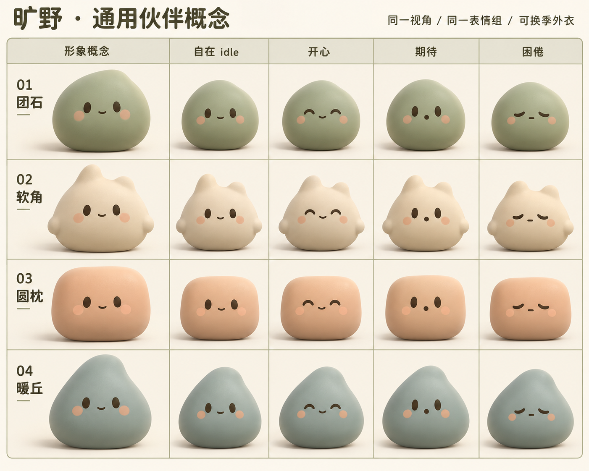

# 通用吉祥物 · 2026-09

用户选择 **02 软角**，授权接入试验台并替换主站。其余01团石、03圆枕、04暖丘保留为idea，未实现。

软角识别点：暖白色（按2026-09-19反馈，由燕麦奶油色提亮，减弱褐色阴影）、饱满闭合体积、两个不等高的短圆凸起、融合身体的微小侧凸、暖深色小五官、克制的桃色脸颊。不能把软角拉尖成猫耳，不能把身体压成扁片；深色眼形在开合和弯曲中连续变化，不切换成心形/星形或白眼。

本次默认02通用皮肤。赛季外观作为独立色彩与几何配置，不影响情绪参数、家具互动、经济或存档。原绿色双叶是第一赛季的视觉主题；后续收获季再设计，不提前替用户决定外观。当前不新增换肤商城或收费入口。

概念图由内置 imagegen 生成，仅作设计参考，不作为角色贴图。提示要点：四行五列统一正视角、每方向概念/idle/开心/期待/困倦，低饱和柔软材质与闭合简轮廓。参考 momo-soft-play 的亲和体积，不复制其贴图实现。

## 轮廓与 morph 评估

| 编号 | 保留的设计意图 | 程序化 morph 判断 |
|---|---|---|
| 01 团石 | 灰绿圆团，重心偏低，像掌心的小石头 | 容易：闭合圆润轮廓、少量不对称控制点即可；需避免变成没有辨识点的圆球 |
| 02 软角（已选） | 暖白饱满身体、两枚不等高短圆角、浅桃脸颊 | 容易至中等：固定拓扑的64点轮廓；正面五官连续变形，厚度独立保留，圆角不能在过渡中变尖 |
| 03 圆枕 | 浅杏色圆角方团，安静、居家 | 容易：超椭圆式轮廓稳定；笑/困时只压缩圆角和高宽，不能突然换成圆形 |
| 04 暖丘 | 雾蓝灰非对称小山丘，略向一边依靠 | 中等：左右重心要连续迁移；避免表情倾斜叠加身体倾斜导致歪倒 |

四方向的 idle/开心/期待/困倦小样均在上方统一视角概念图中。01/03/04只是归档概念，不承诺已做成可用皮肤。02的实际程序化版本使用更明亮的暖白，概念原图保留以便对比选择过程。
